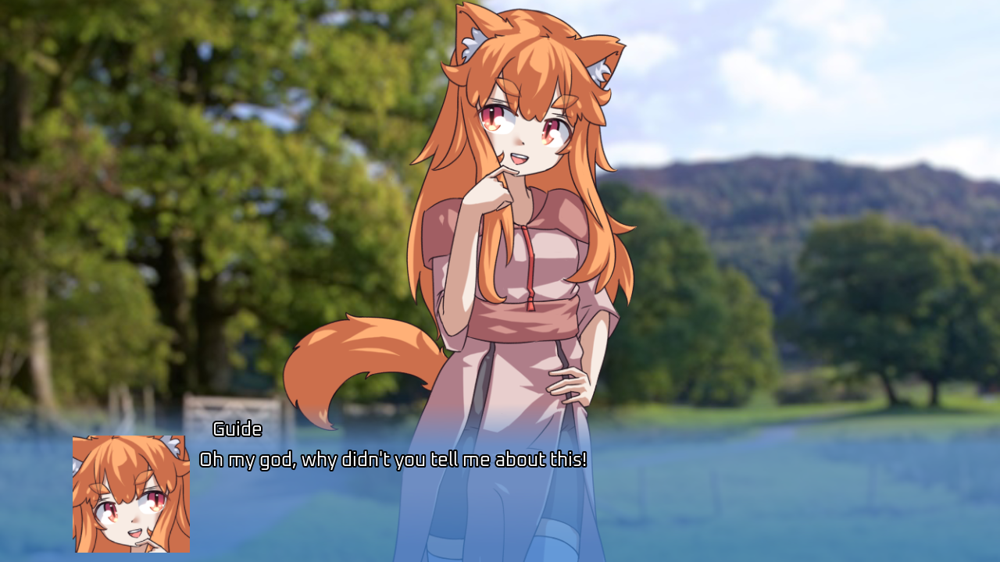

# Mini Mirage 

Mini Mirage is a public domain and lightweight VN-style cutscene engine (not meant for actual VNs). This is the Godot 4 version.

Features: showing backgrounds/CGs, tachie (standing sprites), smooth zooming/scaling, smooth repositioning, both ADV and chat-bubble-style textboxes, textbox portraits/nametags, and arbitrary game code in the middle of cutscenes (cutscenes are just gdscript functions).

Don't try to use this for actual VNs. It's missing a large number of essential VN features, like transition masks, saving mid-cutscene, a backlog, etc.



Example cutscene:

```gdscript
func mini_demo_cutscene(cutscene : CutsceneInstance):
    var bg_texture = load("res://minimirage/art/test_bg.jpg")
    var tachie = load("res://minimirage/art/tachie/vn engine test tachie base.png")
    
    var bg_image = cutscene.add_background(bg_texture)
    await bg_image.fade_show()
    
    var image = cutscene.add_tachie(tachie)
    await image.fade_show()
    
    cutscene.set_nametag("Guide")
    
    await cutscene.set_text("Hello, world!")
    
    cutscene.finish()
```

## Docs

Copy the `minimirage` folder into your project. See `Demo.tscn` for example usage. Skim the comments in the `.gd` files in `minimirage/scenes/` to get a feel for what the API looks like.

The Godot 3 version of Mini Mirage uses static functions on CutsceneInstance to handle tachie/background changes. The Godot 4 version uses async functions on each CutsceneRect object instead.

Custom input actions you can add: 

`cutscene_advance` - to advance text. pressing down on this also causes currently-running animations to be skipped. 

(common example: m1, down arrow) 

`cutscene_instant_text` - to make text instantly appear, but not advance. also doesn't skip animations. 

(common example: on controllers, the "cancel" button. not needed if that button is bound to "ui_cancel".) 

`cutscene_skip` - hold to skip animations, including the text type-in effect. 

(common example: ctrl. please do not put this on alt.)

